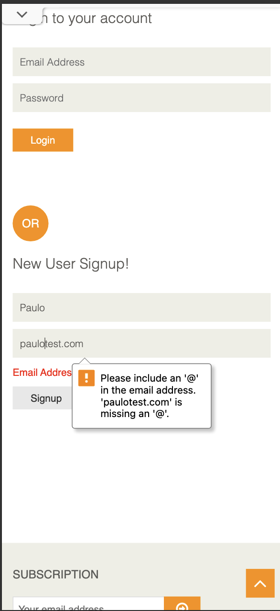
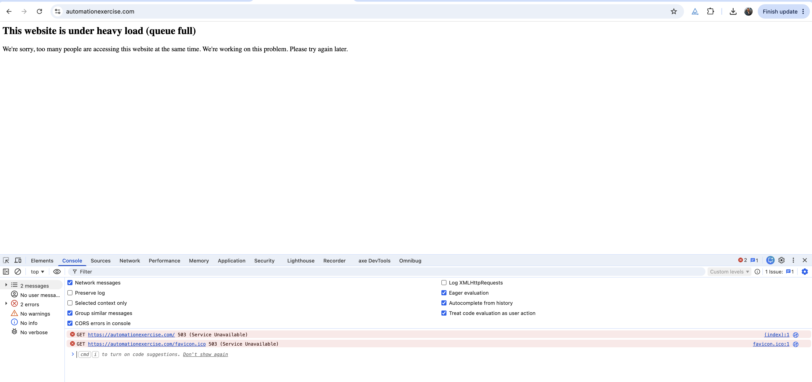
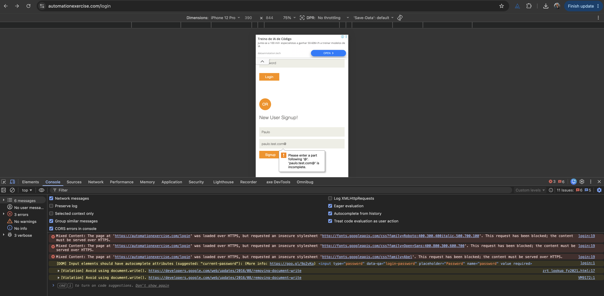

# Exploratory Testing Report

## About this session

| Field | Value |
|-------|-------|
| Tester | Paulo |
| Date | 2026-06-08 |
| Duration | About 45 minutes of active testing |
| Environment | A real iPhone (iOS Safari) plus desktop Chrome with phone sized emulation (iPhone 12 Pro and Pixel 7) |
| Site tested | https://automationexercise.com |
| Evidence | Screenshots, plus console and network captures from the browser tools (in `../evidence/`) |

## What I set out to explore (my charter)

I wanted to walk through the core shopping journey the way a real person on a phone would: creating an account and logging in, browsing and searching for products, and then using the cart and checkout. My aim was to find broken behaviour, gaps in validation, places where the experience is confusing, and risks that are specific to using this on a phone.

What I looked at: sign up and login (including doing things wrong on purpose), browsing, searching and filtering, adding, updating and removing items in the cart, whether the cart survives a refresh, checkout and payment, and how errors are handled.

What I left out of this session on purpose: a full accessibility review, performance measurement, testing across many devices, and completing a real payment.

## The short version

The core journey works well enough to get from browsing to a confirmed order, but along the way I found **21 issues**. One of them is serious enough that I would call it a blocker: the payment screen accepts clearly fake details and still confirms the order. Six more are high priority, covering things like missing validation, a cart you cannot really manage, dangerous one tap account deletion, and a mobile specific problem with adding items to the cart. The complete list, with steps and suggested fixes for each, is in the "Issues and Improvements Tracker" section of this document. The most important ones are written out below with evidence.

| Severity | Count |
|----------|-------|
| Critical | 1 |
| High | 6 |
| Medium | 9 |
| Low | 5 |

## Things I noticed along the way

- The app barely validates anything on its own. The email checks come from the browser, not the app, and on the registration and payment screens almost any text is accepted.
- Money is shown without proper formatting anywhere it appears, for example `Rs. 1500`, or a line total written as `61727722500`. That makes prices hard to read and trust, which matters even more on a global mobile app.
- The phone experience behaves differently from the desktop one. Adding to the cart needs a second tap, and the confirmation popup appears in the wrong place. These are the classic signs of desktop hover behaviour being reused on a touch screen.
- Actions that cannot be undone have no safety net. Both deleting your account and removing a cart item happen instantly with no confirmation.
- The site itself is fragile under load. A "queue full" page with server errors appeared during my session. I noted it, but I treat it as the demo site's own limitation rather than a product problem.

## The main issues I found

The full list is in the tracker. Here are the ones that matter most, with the evidence.

### 1. Payment accepts fake details and still confirms the order (PAY-01). Severity: Critical

What happens: on the payment screen I can type something obviously wrong, like the number `1` in every field, and the order is still confirmed. There is no real check on the card number, expiry, or security code. The only thing stopping me is the browser's built in "this field is required" message on an empty field.

How to reproduce:
1. Add a product and go through checkout to the payment screen.
2. Type `1` into Name on Card, Card Number, CVC, and Expiration.
3. Tap Pay and Confirm Order.

What I expected: the payment details to be properly checked and rejected when they are clearly invalid.

What actually happened: the order was confirmed with nonsense payment details.

Why this matters: this is the step where money changes hands, so it is the most important thing to get right. In a real product this would be unacceptable, and on a phone it is made worse by shaky connections that can cause double submissions. This is the first thing I would want fixed.

### 2. The signup form accepts a badly formed email (AUTH-01). Severity: High

What happens: the email field only uses the browser's basic check. So `missing@` style mistakes get caught by the browser, but `paulo@test` (which has no proper domain) is accepted and lets me create an account. In other words, the app adds no email checking of its own beyond the bare minimum the browser provides.

How to reproduce:
1. Go to Signup and Login, then New User Signup.
2. Enter the name `Paulo` and the email `paulo@test`, then tap Signup.

What I expected: an email without a real domain to be rejected, and ideally confirmed by sending a verification email.

What actually happened: it was accepted and moved on to the account information page.

Why this matters: the email address is how the account is identified and how the customer receives order confirmations and password resets. Accepting unreachable addresses leads to junk accounts and broken communication.

Evidence, showing the contrast between what the browser blocks and what the app lets through:

### 3. Adding to the cart needs two taps on mobile (ATC-02). Severity: High (mobile)

What happens: on a phone, the first tap on a product's Add to Cart button does not add it. Instead an orange slider appears, and I have to tap Add to Cart a second time before the product is actually added.

How to reproduce:
1. On a phone, open Products.
2. Tap Add to Cart on a product. An orange overlay appears.
3. Tap Add to Cart again. Now it is added.

What I expected: one tap to add the product.

What actually happened: it took two taps, because a desktop hover effect is being shown on a touch screen.

Why this matters: every extra tap on the path to buying costs sales, and this happens right on the most important action, specifically on mobile. This is exactly the kind of phone only problem a mobile QA role should catch.

Evidence: seen on the device. The related confirmation popup is captured in `../evidence/atc03-added-popup-mobile.png`.

### 4. You cannot change the quantity in the cart (CART-01). Severity: High

What happens: once items are in the cart, there is no way to change the quantity on the cart screen. The quantity can only be set on the product page before adding.

How to reproduce: add a product, open the cart, and try to change its quantity.

What I expected: to be able to edit the quantity in the cart, with the total updating.

What actually happened: the quantity is fixed.

Why this matters: changing quantity in the cart is something every shopper expects. Without it, people have to remove and re-add items, which is annoying and can lose the sale.

Evidence: `../evidence/cart04-line-total-and-qty.png` (the quantity appears as a fixed value).

### 5. "Delete Account" happens with no confirmation (AUTH-04). Severity: High

What happens: a logged in user can permanently delete their account with a single click. There is no confirmation step and no need to re-enter the password.

How to reproduce: log in, then click Delete Account.

What I expected: a confirmation step before something this final.

What actually happened: the account was deleted right away.

Why this matters: this is permanent and cannot be undone. An accidental tap, which is easy to do on a phone, would wipe the account with no way back.

### 6. On mobile, the duplicate email error scrolls out of view (AUTH-03, also answers Discovery Q1). Severity: Medium (mobile)

What happens: when I try to sign up with an email that already exists, the app correctly shows the message "Email Address already exist!". But on mobile the page jumps back to the top, so the message, which sits lower down, is off screen. The user has to scroll down to find out why the signup did not work.

How to reproduce:
1. On a phone, go to New User Signup.
2. Enter an email that already exists (`paulo@test.com`) and tap Signup.

What I expected: the error to be visible, either by scrolling to it or showing it next to the field.

What actually happened: the page jumped to the top and the red error was left below the fold.

Why this matters: on a small screen, an error the user cannot see feels like the app simply did nothing. People may give up or keep retrying without understanding why. This is a clear mobile experience problem.

Evidence: `../evidence/q1-duplicate-email-mobile.png`.

The remaining issues (no overall cart total, unlimited quantity, a wrong product showing under a category filter, prices and totals without currency formatting, the Enter key not running a search, the popup behaviour, no field highlight on empty required fields, removing a cart item with no confirmation, the misaligned search button, the site overload page, and the lack of a profile area) are all written up with steps, severity, and suggested fixes in the "Issues and Improvements Tracker" section of this document.

## What I saw in the browser tools (console and network)

I also kept an eye on the browser's developer tools, which gives some useful extra evidence:

- The site returned **503 Service Unavailable** errors on the home page and favicon when it hit its "heavy load (queue full)" state. The console and network panels both show this (`stab01-console-503.png`, `stab01-network-503.png`, `stab01-heavy-load-mobile.png`).
- On the login page there were **mixed content** warnings: the page is served securely over HTTPS, but it tries to load fonts over insecure HTTP, so the browser blocks them (`console-login-mixed-content.png`).
- The password field is missing the `autocomplete` setting that browsers recommend, and there were warnings about an outdated way of writing to the page (`document.write`).

## What worked as expected

- Registering a brand new user works and logs you in.
- Trying to register an email that already exists is correctly blocked with a clear message. The only problem is where that message ends up on mobile (issue AUTH-03).
- Logging in with the wrong password is rejected with a clear error. I confirmed this by hand and with automation.
- Adding to the cart and keeping the items after a refresh works. I confirmed this with automation (see Discovery Q2).
- The browser correctly blocks the most obvious bad emails, such as a missing or trailing `@`.

## Evidence index

| Reference | File | What it shows |
|-----------|------|----------------|
| AUTH-01 | `evidence/auth01-email-missing-at.png` | Browser blocks a missing `@` |
| AUTH-01 | `evidence/auth01-email-trailing-at.png` | Browser blocks a trailing `@` |
| AUTH-01 | `evidence/auth01-email-no-tld-accepted.png` | `paulo@test` is accepted and moves to account info |
| AUTH-03 / Q1 | `evidence/q1-duplicate-email-mobile.png` | The "Email Address already exist!" message on mobile |
| ATC-03 | `evidence/atc03-added-popup-mobile.png` | Where the "Added" popup appears on mobile |
| CART-04 / CART-06 | `evidence/cart04-line-total-and-qty.png` | An unformatted line total (`61727722500`) and a quantity of `123455445` |
| BRW-01 | `evidence/BRW-01.png` | Kids and Dress filter showing a product that is not a dress |
| BRW-02 | `evidence/BRW-02.png` | Prices shown as `Rs. 500/400/1000/1500` with no formatting |
| BRW-03 | `evidence/BRW-03.png` | "Shirt" typed in search, but pressing Enter does nothing |
| BRW-04 | `evidence/BRW-04.png` | The search button not lined up with the search bar |
| STAB-01 | `evidence/stab01-heavy-load-mobile.png` | The "under heavy load (queue full)" page |
| STAB-01 | `evidence/stab01-network-503.png` | Network panel showing the 503 |
| STAB-01 | `evidence/stab01-console-503.png` | Console showing 503 Service Unavailable |
| Console | `evidence/console-login-mixed-content.png` | Mixed content, autocomplete, and document.write warnings |

## Notes and limits of this session

- I focused on the buying journey within my time limit, and deliberately left aside the wider areas like full device coverage, accessibility, and performance.
- I did not complete a real payment. I observed the payment acceptance problem (PAY-01) up to the point where the order is confirmed.
- I confirmed cart persistence after refresh (Discovery Q2) using the automated test rather than a manual screenshot.
- I treat the site's overload page (STAB-01) as a limitation of the demo environment rather than the product, but the way it is shown to users and the errors behind it are still worth noting.
- If I had more time, I would focus next on what happens when the app is closed and reopened on a real phone, recovering from going offline and back online, and a proper accessibility pass with VoiceOver and TalkBack.
