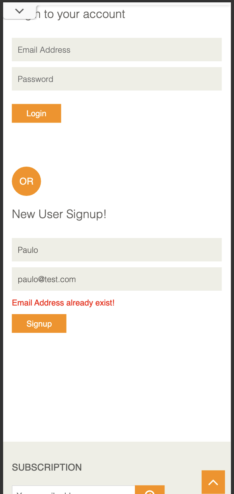
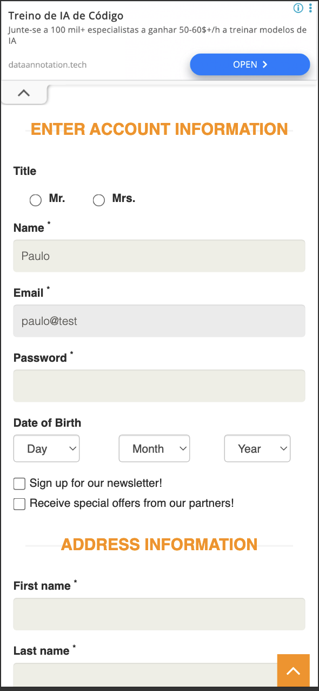
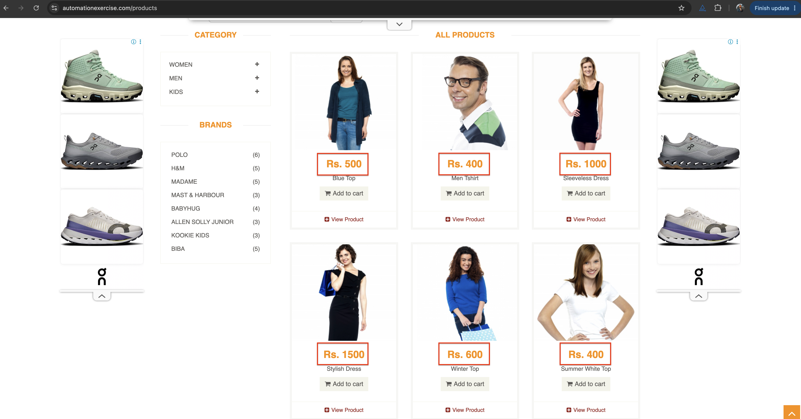

# Product Discovery Questions

These are my answers to the three product questions. For each one I describe what I actually saw and how I checked it. Where an issue has a tracking ID, it is written up in full in the "Issues and Improvements Tracker" section of this document. The testing was done on 2026-06-08, using a real iPhone (iOS Safari) and desktop Chrome with phone sized emulation.

## Question 1. Creating an account with an email that already exists

**What the system does:**
The app handles this correctly. When I fill in the New User Signup form with an email that is already registered (`paulo@test.com`), it does not create a second account. It stays on the signup form, shows an error, and does not move on to the account information step.

**The error message:**
A red message saying "Email Address already exist!" appears under the email field.

**Does the behaviour seem correct?**
Mostly yes, but with two real problems around it.

First, blocking the duplicate is the right thing to do, and the message itself is clear. So the core behaviour is correct.

However, on mobile there is a problem with the message being seen at all. When I submit, the page jumps back to the top, and the error sits lower down, off screen. The form looks like it just reset itself for no reason, and the user has to scroll down to find out why. The message should either scroll into view or appear right next to the field. I tracked this as issue AUTH-03.

Second, there is a gap in how emails are checked in the first place. The signup field only uses the browser's basic email check. The browser blocks obvious mistakes like a missing `@` or a trailing `@`, but `paulo@test`, which has no real domain, is accepted and lets me create an account. So while duplicate emails are caught, badly formed emails are not, because the app does no checking of its own beyond the browser's minimum. I tracked this as issue AUTH-01. (One small extra point: telling the user plainly that an email "already exists" also makes it easier for someone to find out which emails are registered. That is fine for a demo, but worth thinking about for a real product.)

**How I checked it:**
I reproduced the duplicate email block on mobile, shown in `evidence/q1-duplicate-email-mobile.png`. I also tested several email formats: `missing @` and a trailing `@` were both blocked by the browser (`auth01-email-missing-at.png`, `auth01-email-trailing-at.png`), while `paulo@test` was accepted and moved on to the account information page (`auth01-email-no-tld-accepted.png`).

## Question 2. Adding several products to the cart and refreshing the page

**What happens:**
The cart keeps its contents after a refresh. The items and quantities are still there when the page reloads.

**Is this expected?**
Yes. This is what users expect and want. A cart that survives a reload protects the path to buying, and it makes sense that the site remembers the cart through a stored session rather than only keeping it in the current page.

**What risk could this introduce on a mobile app?**
Keeping the cart is good, but it raises some questions that are specific to a phone, and these are exactly the things I would want to test:

- Does the cart survive the app being fully closed and reopened, not just a page refresh? On a phone the operating system can shut the app down in the background, which is much harsher than a simple reload, and that is where mobile apps often behave differently from the website.
- Is the cart tied to the user's account and shared across their devices, or is it only stored on that one phone and lost if they reinstall or log out?
- If a cart is kept for a long time, the items in it might go out of stock or change price by the time the user checks out. So keeping the cart needs to be balanced against showing up to date stock and prices.

**How I checked it:**
This is backed by an automated test included with this submission (the cart test). The test adds two products, opens the cart, checks that there are two items, refreshes the page, and checks again that there are still two items. It passes. I chose to make this an automated check on purpose, so that if this behaviour ever breaks in the future, it gets caught straight away. My manual check matched the automated result. I did not take a separate manual screenshot of the refresh, since the behaviour is already covered by the test.

## Question 3. A browsing behaviour that could confuse or frustrate users

**My main example: prices are shown without any currency or number formatting (issue BRW-02).**

**What I saw:**
On the Home and Products screens, prices appear as plain values like `Rs. 500`, `Rs. 1000`, and `Rs. 1500`, with no clear currency and no proper number formatting. In the cart it gets worse, where a line total shows up as `Rs. 61727722500`, just a long string of digits (issue CART-04).

**Why it could be a problem:**
- It is unclear. "Rs." (Indian Rupees) will not be understood by a lot of people around the world, and a number like `1500` with no separators or decimals is easy to misread.
- It hurts trust at the exact moment someone is about to spend money, which is the worst place to create doubt.
- It is worse on a phone. There is less space, people read at a glance, and they are often shopping while out and about. A huge unformatted number like the cart total is genuinely hard to read on a small screen.

**How I would improve it:**
- Format every price properly, with the right currency symbol and correct grouping and decimals, for example `₹1,500.00`.
- Base the currency and format on the user's region, so it makes sense in each market.
- Add an automated check that prices match the expected format, so this does not quietly break again later.

**How I checked it:**
I captured the products list with the plain prices (`evidence/BRW-02.png`) and the unformatted cart total (`evidence/cart04-line-total-and-qty.png`).

**A couple of other strong candidates** I also found, in case they are of interest (both are in the tracker):
- The Kids and Dress category filter shows a product that is not a dress ("Sleeves Top and Short"), which makes the filtering feel unreliable (`evidence/BRW-01.png`).
- On desktop, pressing Enter in the search box does nothing. Only clicking the search button works (`evidence/BRW-03.png`).

## Evidence index

| Question | File | What it shows |
|----------|------|----------------|
| Q1 | `evidence/q1-duplicate-email-mobile.png` | "Email Address already exist!" on mobile |
| Q1 | `evidence/auth01-email-no-tld-accepted.png` | `paulo@test` accepted and moving to account info |
| Q1 | `evidence/auth01-email-missing-at.png`, `auth01-email-trailing-at.png` | The browser blocks these two |
| Q2 | Automated cart test (passing) | The cart survives a refresh |
| Q3 | `evidence/BRW-02.png` | Prices without currency formatting |
| Q3 | `evidence/cart04-line-total-and-qty.png` | An unformatted cart line total |
| Q3 | `evidence/BRW-01.png` | A wrong result under the category filter |
